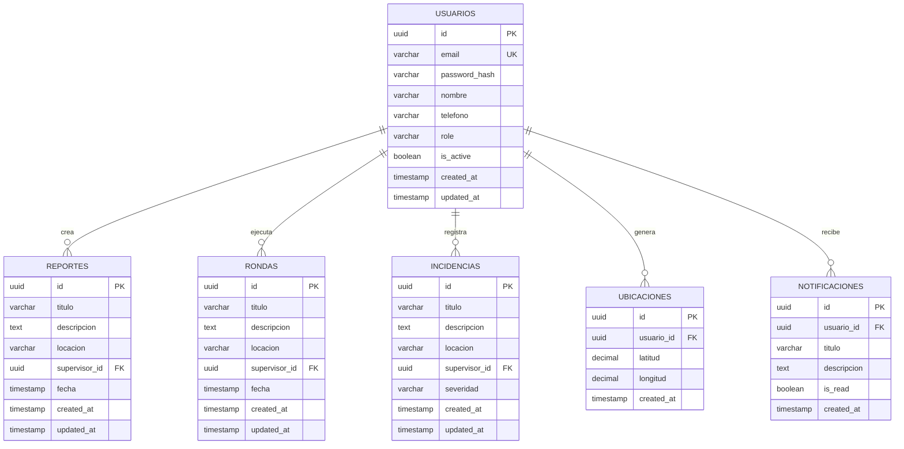
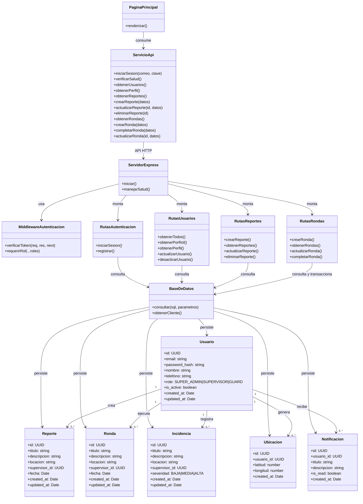
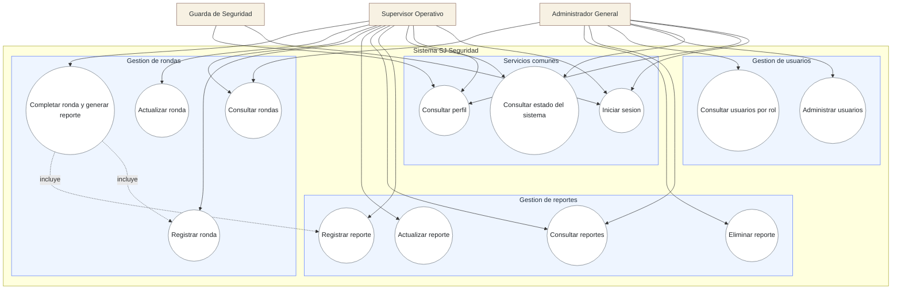

# Diagramas Funcionales en Mermaid

Estos diagramas reflejan la arquitectura y el modelo de datos actualmente implementados en el proyecto con PostgreSQL, Express y Next.js.

## Modelo Entidad Relacion (MER)

## Diagrama de Clases

## Diagrama de Casos de Uso

